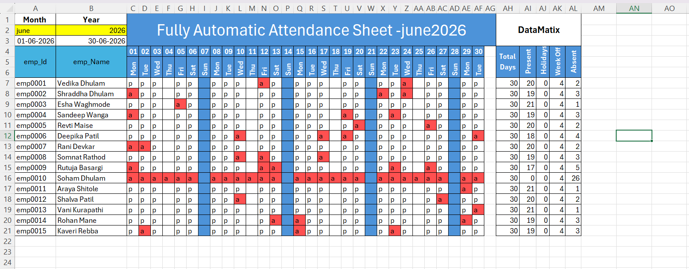
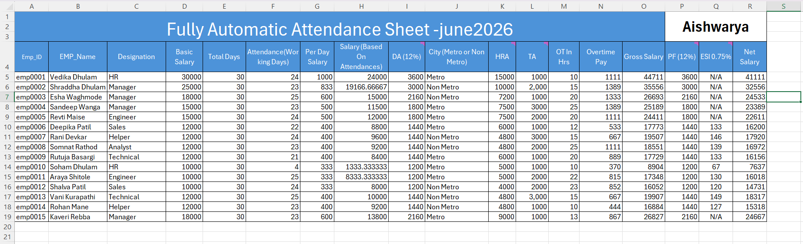

# Fully_Automated_attendence_sheet
An Excel-based Automatic Attendance &amp; Payroll Management System that automates employee attendance tracking and payroll generation. The project calculates working days, overtime, allowances, PF, ESI, gross salary, and net salary using Excel formulas and VBA, reducing manual effort while improving payroll accuracy and efficiency.
# 📊 Automatic Attendance & Payroll Management System using Microsoft Excel

An Excel VBA-based **Automatic Attendance and Payroll Management System** that automates employee attendance tracking and salary calculation. The system records daily attendance, calculates working days, overtime, allowances, deductions, and generates an accurate payroll sheet automatically. Built using Microsoft Excel formulas, conditional formatting, and automation techniques, this project eliminates manual calculations, reduces payroll errors, and improves HR efficiency. It serves as an excellent learning project for Excel automation, payroll processing, and office management systems.

---

# 🚀 Features

- 📅 Automatic Monthly Attendance Sheet
- 👨‍💼 Employee Attendance Tracking
- ✔ Present, Absent, Holiday & Weekly Off Calculation
- 📈 Working Days Calculation
- 💰 Automatic Payroll Generation
- 🧮 Gross Salary & Net Salary Calculation
- 🏠 HRA Calculation
- 🚗 Travel Allowance (TA)
- 💵 Dearness Allowance (DA)
- ⏰ Overtime Hours & Overtime Pay
- 🏦 PF & ESI Deduction Calculation
- 📊 Dynamic Payroll Report
- 🎨 Conditional Formatting for Attendance Status
- 📋 Employee-wise Salary Summary
- ⚡ Fully Automated Excel Formulas
- 📑 Monthly Payroll Processing

---

# 📷 Project Screenshots

## Attendance Management Sheet



---

## Payroll Sheet



---

# 📌 Project Overview

Managing employee attendance and payroll manually is time-consuming and prone to errors. This project automates the complete payroll process using Microsoft Excel.

The system records daily attendance for each employee and automatically calculates:

- Present Days
- Absent Days
- Weekly Offs
- Holidays
- Working Days
- Per Day Salary
- Salary Based on Attendance
- DA
- HRA
- TA
- Overtime Pay
- Gross Salary
- PF
- ESI
- Net Salary

The payroll is generated automatically without manual calculations.

---

# 📂 Project Structure

```
Automatic-Attendance-Payroll-System/
│
├── Automatic Attendance Payroll.xlsm
├── README.md
├── Automatic_Attendance_System_Sheet.png
├── Automatic_Attendance_Database_Sheet.png
└── VBA Modules
```

---

# 📅 Attendance Sheet

The attendance sheet records daily attendance for every employee.

Attendance Codes:

| Code | Meaning |
|------|----------|
| P | Present |
| A | Absent |
| WO | Weekly Off |
| H | Holiday |

Automatically calculates:

- Total Days
- Present
- Holidays
- Weekly Off
- Absent

---

# 💰 Payroll Sheet

The payroll sheet contains:

| Field |
|--------|
| Employee ID |
| Employee Name |
| Designation |
| Basic Salary |
| Total Days |
| Working Days |
| Per Day Salary |
| Salary Based on Attendance |
| DA (12%) |
| City |
| HRA |
| TA |
| Overtime Hours |
| Overtime Pay |
| Gross Salary |
| PF (12%) |
| ESI |
| Net Salary |

---

# 🧮 Payroll Calculation

The payroll is generated using automatic Excel formulas.

### Per Day Salary

```
Basic Salary ÷ Total Days
```

### Attendance Salary

```
Per Day Salary × Working Days
```

### Gross Salary

```
Attendance Salary
+ DA
+ HRA
+ TA
+ Overtime Pay
```

### Net Salary

```
Gross Salary
− PF
− ESI
```

---

# ⚙️ How It Works

### Step 1

Enter employee attendance.

↓

### Step 2

Working days are calculated automatically.

↓

### Step 3

Salary based on attendance is generated.

↓

### Step 4

Allowances are added.

↓

### Step 5

PF & ESI deductions are calculated.

↓

### Step 6

Net Salary is generated automatically.

---

# 💻 Technologies Used

- Microsoft Excel
- Excel Formulas
- Excel VBA
- Conditional Formatting
- Payroll Automation
- Spreadsheet Functions
- Office Automation

---

# 📚 Excel Concepts Used

- IF Function
- COUNTIF
- SUM
- VLOOKUP/XLOOKUP
- Data Validation
- Conditional Formatting
- Named Ranges
- Payroll Formulas
- Attendance Tracking
- Dynamic Salary Calculation

---

# 🎯 Learning Outcomes

This project demonstrates:

- Excel Payroll Automation
- Attendance Management
- HR Record Management
- Payroll Processing
- Formula-Based Automation
- Employee Salary Calculation
- Excel Dashboard Design
- Office Productivity Automation

---

# 🔮 Future Improvements

Future enhancements may include:

- Employee Leave Management
- Auto Attendance Import
- Employee Master Database
- Salary Slip Generation (PDF)
- Email Salary Slips
- Attendance Dashboard
- Monthly Reports
- Employee Search
- Department-wise Payroll
- Income Tax Calculation
- Bonus & Incentive Calculation
- Biometric Attendance Integration

---

# 📖 Use Cases

This project is suitable for:

- HR Departments
- Small & Medium Businesses
- Payroll Management
- Excel VBA Learning
- College Mini & Major Projects
- Office Automation
- Employee Salary Processing
- Portfolio Projects

---

# 🚀 Getting Started

1. Clone the repository

```bash
git clone https://github.com/yourusername/Automatic-Attendance-Payroll-System.git
```

2. Open the `.xlsm` file using Microsoft Excel.

3. Enable Macros.

4. Update employee attendance.

5. The payroll sheet will be generated automatically.

---

# 🤝 Contributing

Contributions are welcome!

1. Fork the repository
2. Create a feature branch
3. Commit your changes
4. Push the branch
5. Create a Pull Request

---

# 👩‍💻 Author

**Aishwarya Dhulam**

*MCA Student | Aspiring Data Analyst | Excel Automation & VBA Enthusiast*

---

# ⭐ Support

If you found this project helpful, please consider giving it a **⭐ Star** on GitHub. Your support helps others discover the project and encourages future improvements.
